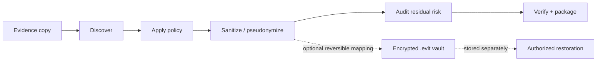

<p align="center">
  
</p>

<p align="center">
  <strong>Share incident data without exposing the incident.</strong><br>
  Local-first privacy engineering for cybersecurity evidence.
</p>

<p align="center">
  <a href="https://github.com/MrTaherAmine/evidenceveil/releases/latest"></a>
  
  <a href="LICENSE"></a>
  
</p>

---

## What is EvidenceVeil?

**EvidenceVeil** helps security teams share incident evidence with less unnecessary exposure.

Logs, exports and investigation artifacts often contain much more than the information a recipient actually needs: usernames, email addresses, internal IPs, hostnames, cloud identifiers, tokens, repository names, timestamps and other sensitive context.

EvidenceVeil gives you a controlled workflow to **discover**, **transform**, **audit** and **package** that evidence locally before it leaves your environment.

> [!IMPORTANT]
> EvidenceVeil reduces disclosure risk. It does **not** guarantee anonymity, determine legal anonymisation, or automatically decide that a dataset is safe to publish.

### Built for

- SOC and CSIRT teams
- DFIR and incident-response practitioners
- Security researchers and detection engineers
- Privacy and security engineering teams
- Organizations sharing evidence with vendors, partners or other responders

---

## How it works



EvidenceVeil never needs to modify the original evidence in place. Reversible mappings, when used, live in a **separate encrypted vault** rather than inside the shareable bundle.

---

## Quick start

### 1. Install

Download the wheel from the [latest GitHub release](https://github.com/MrTaherAmine/evidenceveil/releases/latest), then:

```bash
python -m pip install evidenceveil-1.0.0-py3-none-any.whl
```

Or install from a clone:

```bash
git clone https://github.com/MrTaherAmine/evidenceveil.git
cd evidenceveil
python -m pip install .
```

Check the environment:

```bash
evidenceveil doctor
```

### 2. Discover what is sensitive

```bash
evidenceveil discover ./evidence-export
```

### 3. Sanitize with a built-in policy

```bash
export EVIDENCEVEIL_VAULT_PASSPHRASE='use-a-strong-secret'

evidenceveil sanitize ./evidence-export \
  --policy vendor-support \
  --new-key \
  --vault ../secure-vaults/case.evlt \
  --output ./evidenceveil-output \
  --report
```

### 4. Audit and verify

```bash
evidenceveil audit ./evidenceveil-output
evidenceveil verify ./evidenceveil-output
```

Need authorized restoration later?

```bash
evidenceveil restore ./evidenceveil-output/sanitized \
  --vault ../secure-vaults/case.evlt \
  --output ./restored-evidence
```

> Redaction, dropping and other irreversible transformations cannot be restored.

---

## What you get

```text
evidenceveil-output/
├── sanitized/          transformed evidence for controlled sharing
├── provenance/         risk, utility and transformation records
├── reports/            self-contained offline reports
├── manifest.json       hashes, policy, counts and identifiers
└── checksums.sha256    integrity verification

case.evlt                encrypted mapping vault — stored separately
```

---

## Core capabilities

| Capability | What it does |
|---|---|
| **Sensitive-data discovery** | Finds security-relevant identifiers and secret-like fields across supported evidence formats. |
| **Policy-as-code** | Makes sharing rules explicit, reviewable and repeatable. |
| **Pseudonymization** | Preserves useful relationships without exposing original values. |
| **Redaction & transformation** | Supports masking, dropping, generalization, bucketing, shifting, synthesis and more. |
| **Encrypted reversible vaults** | Keeps optional restoration mappings outside the shareable package. |
| **Residual-risk audit** | Flags identifier-like remnants and untransformed free text for human review. |
| **Integrity verification** | Uses hashes and manifests to detect package modification. |
| **Offline reporting** | Produces self-contained HTML reports with no external assets or analytics. |
| **Utility checks** | Helps confirm that selected structural properties survive transformation. |
| **Secure-by-default handling** | Refuses in-place output, applies archive safety checks and neutralizes CSV formula injection. |

---

## Built-in sharing policies

Choose a sensible starting point and adapt it to your context:

| Policy | Designed for |
|---|---|
| `vendor-support` | Sharing evidence with a known support/vendor recipient |
| `cross-organization-ir` | Coordinated incident response between organizations |
| `public-research-strict` | More restrictive public research release |
| `internal-handoff` | Least-privilege internal sharing |
| `reversible-investigation` | Authorized workflows where selected mappings must be recoverable |
| `training-dataset` | Reusable training fixtures |
| `detection-fixture` | Detection-engineering test data |

See [Policy Authoring](docs/policy-authoring.md) for custom policies.

---

## Transformations

EvidenceVeil supports:

`keep` · `drop` · `redact` · `mask` · `tokenize` · `pseudonymize` · `generalize` · `bucket` · `shift` · `truncate` · `replace` · `synthesize` · `hmac` · `preserve` · `quarantine`

Deterministic keyed transformations can preserve selected relationships such as repeated identities, hosts, sessions and temporal ordering without relying on predictable unkeyed hashes.

---

## Format support

### Ready in v1.0

- Text and application logs
- Syslog-like text
- CEF / LEEF
- JSON
- JSONL / NDJSON
- CSV / TSV
- ECS / OCSF / OpenTelemetry-style JSON
- STIX 2.1 JSON bundles
- Gzip text input

### Recognized, but not parsed/sanitized in v1.0

- EVTX
- Parquet

Archive safety primitives are included, but direct CLI sanitization of ZIP/TAR archives is not claimed in v1.0. See [Format Support](docs/format-support.md) for the exact compatibility matrix.

---

## Security model

EvidenceVeil is intentionally **local-first**. Core processing does not require uploading evidence to an external service.

Security-focused defaults include:

- no in-place sanitization
- symlink refusal by default
- no execution of evidence content
- safe YAML loading and typed policy validation
- archive traversal and link protections
- terminal-control sanitization
- CSV formula-injection defense
- Argon2id for passphrase-based vault key derivation
- ChaCha20-Poly1305 authenticated encryption
- domain-separated HMAC-SHA-256 for deterministic token derivation
- separate storage of reversible mapping vaults

For the full design, read the [Threat Model](docs/threat-model.md), [Cryptography](docs/cryptography.md), [Privacy Model](docs/privacy-model.md) and [Limitations](docs/limitations.md).

---

## Residual-risk decisions

`evidenceveil audit` deliberately uses conservative release states:

- `blocked`
- `review-required`
- `eligible-for-controlled-review`

EvidenceVeil never turns a numerical score into an unconditional **“safe to share”** decision.

---

## CLI at a glance

```text
evidenceveil version
evidenceveil about
evidenceveil doctor

evidenceveil discover INPUT
evidenceveil plan INPUT --policy POLICY
evidenceveil sanitize INPUT --policy POLICY --output OUTPUT
evidenceveil audit INPUT
evidenceveil verify BUNDLE
evidenceveil restore INPUT --vault VAULT --output OUTPUT
evidenceveil diff ORIGINAL SANITIZED

evidenceveil policies list
evidenceveil policies show POLICY
evidenceveil policies validate PATH
evidenceveil formats list
evidenceveil plugins list
```

---

## v1.0.0 validation

The first public release was validated locally on macOS with Python 3.14, including:

- **44 automated tests passing**
- **92%+ branch-aware coverage**
- Ruff static analysis passing
- mypy type checking passing
- `pip check` passing
- `pip-audit` reporting no known third-party dependency vulnerabilities in the validated environment
- Bandit reporting no identified issues after reviewed false-positive suppressions
- sanitization, restoration and bundle-integrity checks
- wheel and source-distribution build validation

Cross-platform GitHub CI is planned separately and is not implied by the local validation above.

---

## Documentation

Looking for the details? Start here:

- [Incident Sharing Workflow](docs/incident-sharing-workflow.md)
- [Vendor Sharing Workflow](docs/vendor-sharing-workflow.md)
- [Policy Authoring](docs/policy-authoring.md)
- [Transformation Reference](docs/transformation-reference.md)
- [Risk Methodology](docs/risk-methodology.md)
- [Key Management](docs/key-management.md)
- [Threat Model](docs/threat-model.md)
- [Limitations](docs/limitations.md)

---

## Contributing

Ideas, new evidence formats, policy improvements, edge cases, bug reports and security review are welcome.

Read [CONTRIBUTING.md](CONTRIBUTING.md) before opening a pull request. For security issues, please follow [SECURITY.md](SECURITY.md) rather than disclosing vulnerabilities publicly.

See the [Roadmap](ROADMAP.md) for planned work.

---

## License

EvidenceVeil is released under the **Apache License 2.0**. See [LICENSE](LICENSE).

---

<p align="center">
  <strong>EvidenceVeil</strong><br>
  Created and maintained by <strong>Taher Amine ELHOUARI</strong><br>
  <a href="https://www.taheramine.org">taheramine.org</a> · <a href="https://github.com/MrTaherAmine">GitHub @MrTaherAmine</a>
</p>
