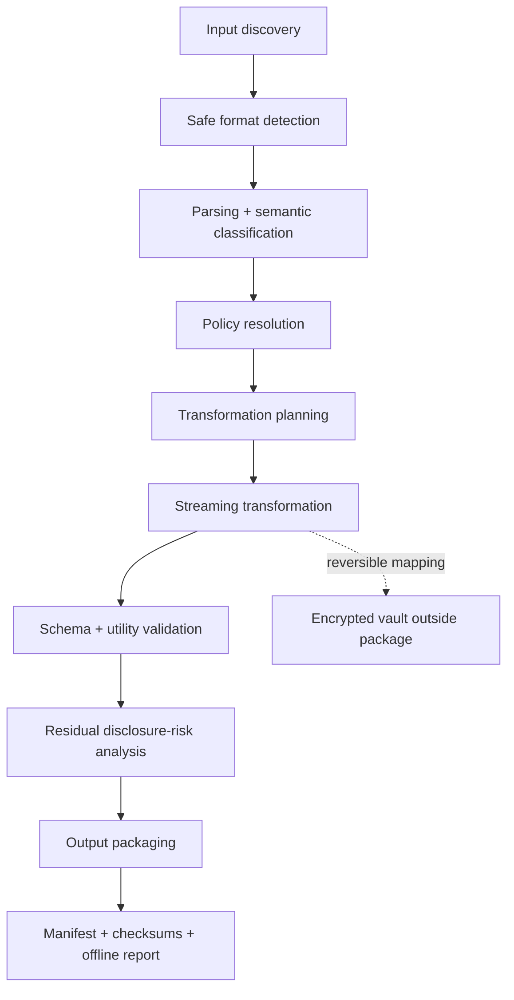

<p align="center"></p>

# EvidenceVeil

[](https://github.com/MrTaherAmine/evidenceveil/actions/workflows/ci.yml)
[](https://github.com/MrTaherAmine/evidenceveil/actions/workflows/codeql.yml)
[](https://www.python.org/)
[](LICENSE)
[](#privacy-and-safety-properties)

**EvidenceVeil** is a local-first, schema-aware privacy engineering tool that sanitizes, pseudonymizes, de-identifies, audits, and packages cybersecurity telemetry and incident-response evidence while preserving relationships needed for investigation, research, detection engineering, and controlled collaboration.

> **Important:** EvidenceVeil reduces identified disclosure risks. It does **not** determine legal anonymisation, guarantee that a release is safe, or replace the data owner’s disclosure review.

Created and maintained by **Taher Amine ELHOUARI** · [taheramine.org](https://www.taheramine.org) · [@MrTaherAmine](https://github.com/MrTaherAmine)

## Why EvidenceVeil?

Security evidence is unusually disclosure-dense. A single log export can contain identities, tokens, internal topology, naming conventions, cloud account IDs, rare behaviors, exact timelines, customer context, and incident scope. Blind redaction often fixes one problem by creating another: it destroys the relationships that make the evidence useful.

EvidenceVeil makes the sharing objective explicit. Policies decide what to keep, remove, generalize, synthesize, or pseudonymize. Keyed deterministic transformations can preserve same-user, same-host, same-session, network-class, URL-shape, and temporal relationships while an encrypted mapping vault—when requested—stays outside the shareable package.

```text
Evidence copy
    │
    ├── discover ──> classes, formats, uncertainty (no raw values by default)
    │
    ├── plan ──────> resolved policy and expected transformations
    │
    └── sanitize
          │
          ├── sanitized/             shareable transformed evidence
          ├── provenance/            risk + utility + transformation evidence
          ├── reports/               self-contained offline HTML + JSON/Markdown
          ├── manifest.json          hashes, policy, counts, key identifier
          └── checksums.sha256       package integrity

Encrypted mapping vault (.evlt)      stored separately; never bundled by default
```

## 60-second quick start

```bash
# Before PyPI publication, install from a clone:
python -m pip install .

# After the v1.0.0 PyPI release, this is equivalent:
# python -m pip install evidenceveil

evidenceveil discover ./evidence-export

evidenceveil plan ./evidence-export \
  --policy vendor-support

export EVIDENCEVEIL_VAULT_PASSPHRASE='use-a-real-secret-from-your-secret-manager'

evidenceveil sanitize ./evidence-export \
  --policy vendor-support \
  --new-key \
  --vault ../secure-vaults/case.evlt \
  --output ./evidenceveil-output \
  --report

evidenceveil audit ./evidenceveil-output
evidenceveil verify ./evidenceveil-output
```

For reversible mapped values:

```bash
evidenceveil restore ./evidenceveil-output/sanitized \
  --vault ../secure-vaults/case.evlt \
  --output ./restored-evidence
```

Irreversible operations such as redaction, drop, or generalization cannot be restored.

## Core commands

```text
evidenceveil version
evidenceveil doctor
evidenceveil init

evidenceveil discover INPUT
evidenceveil plan INPUT --policy POLICY
evidenceveil sanitize INPUT --policy POLICY --output OUTPUT
evidenceveil audit INPUT
evidenceveil verify BUNDLE
evidenceveil restore INPUT --vault VAULT --output OUTPUT
evidenceveil diff ORIGINAL SANITIZED

evidenceveil policies list
evidenceveil policies show POLICY
evidenceveil policies validate PATH
evidenceveil policies scaffold NAME

evidenceveil formats list
evidenceveil plugins list
evidenceveil utility validate ORIGINAL SANITIZED --contract CONTRACT
```

The CLI is designed for human use and CI: stable exit-code families, JSON output, no stack traces for ordinary failures, no in-place mode, and no intentional network activity.

## Built-in policies

| Policy | Intended starting point | Default key scope |
|---|---|---|
| `public-research-strict` | Public research release | per run |
| `vendor-support` | Known vendor/support recipient | per run |
| `cross-organization-ir` | Coordinated incident response | per project |
| `training-dataset` | Reusable training fixtures | per run |
| `detection-fixture` | Detection-engineering fixtures | per run |
| `internal-handoff` | Least-privilege internal handoff | per run |
| `reversible-investigation` | Authorized reversible workspace | per project |

Presets are engineering starting points—not legal conclusions.

## Transformations

EvidenceVeil’s policy DSL supports `keep`, `drop`, `redact`, `mask`, `tokenize`, `pseudonymize`, `generalize`, `bucket`, `shift`, `truncate`, `replace`, `synthesize`, `hmac`, `preserve`, and `quarantine`.

Terminology matters:

- **Redaction** replaces data with a constant removal marker.
- **Masking** leaves limited visible structure and is not equivalent to anonymisation.
- **Pseudonymisation** uses consistent replacements and, when reversible, separately protected additional information. Pseudonymized data may remain personal data.
- **De-identification** is a broader risk-reduction process involving direct identifiers, quasi-identifiers, release context, auxiliary information, and utility.
- **Anonymisation** is not inferred simply because identifiers were replaced. EvidenceVeil never emits an unconditional `safe-to-share: true` conclusion.
- **Synthetic replacement** creates fictitious, format-compatible values and does not prove that the overall record cannot be linked back to a person or organization.

## Correlation preservation

With a stable key and policy, EvidenceVeil can preserve selected relationships:

- repeated identities and email-domain relationships;
- host and domain syntax;
- internal-vs-external IP class, valid IPv4/IPv6 syntax, and documentation ranges for transformed external addresses;
- URL scheme, path depth, extensions, and query-parameter names;
- timestamp ordering and deltas through dataset-wide shifts;
- UUID/session syntax and format-compatible MAC, path, cloud, Kubernetes, and CI/CD identifiers where policy permits;
- record order and structured field types where supported.

Predictable identifiers are **not** protected with unkeyed hashes. Deterministic tokens use domain-separated HMAC-SHA-256-derived material. Mapping collisions are resolved deterministically with domain-separated retries.

## Supported formats

| Format | v1.0 behavior |
|---|---|
| Text / application logs | Streaming line processing |
| RFC 5424-like syslog | Streaming text processing |
| CEF / LEEF | Streaming text processing |
| JSON | Structured processing |
| JSONL / NDJSON | Streaming structured processing |
| CSV / TSV | Record processing with formula-injection defense |
| ECS / OCSF / OpenTelemetry Logs | JSON-aware field classification |
| STIX 2.1 bundles | JSON-preserving import/export; policy must decide indicator treatment |
| Gzip | Streaming text import |
| ZIP / TAR | Safe extraction primitives are included for developers/tests; direct CLI sanitization of archives is not supported in v1.0 |
| EVTX | Recognized as an input type but **not parsed or sanitized in v1.0** |
| Parquet | Recognized as an input type but **not parsed or sanitized in v1.0** |

EVTX/Parquet adapters, binary EVTX rewriting, and PCAP rewriting are **not** claimed in v1.0.

## Policy-as-code example

```yaml
policy_version: "1.0"
id: vendor-support
release_model: known-recipient
default_action: review
key_scope: per_run

tlp:
  label: TLP:AMBER
  set_by_user: true

rules:
  - id: remove-secrets
    priority: 1000
    match:
      semantic_types: [authentication.secret, authentication.token]
    action:
      type: redact
      replacement: "[SECRET_REMOVED]"

  - id: stable-user-pseudonyms
    priority: 500
    match:
      semantic_types: [identity.username, identity.email]
    action:
      type: pseudonymize
      namespace: identity

utility:
  preserve: [event_order, entity_correlation, schema_validity, field_types]

risk:
  block_on_secret: true
```

The public JSON Schema is in [`schemas/policy.schema.json`](schemas/policy.schema.json).

## Encrypted reversible vaults

A `.evlt` vault is an authenticated, versioned envelope stored separately from sanitized output. EvidenceVeil uses:

- CSPRNG-generated key material;
- domain-separated HMAC-SHA-256 for deterministic token derivation;
- Argon2id for passphrase-based vault key derivation;
- ChaCha20-Poly1305 authenticated encryption with unique random nonces;
- authenticated metadata binding the vault to a dataset and policy.

The envelope never stores the passphrase or an unencrypted master key. A wrong or modified vault fails closed. Python cannot promise secure memory erasure, SSD secure deletion, or the absence of swap/crash-dump remnants; see [`docs/cryptography.md`](docs/cryptography.md).

## Residual-risk analysis

`evidenceveil audit` performs a conservative post-transformation scan for residual identifier/credential-like patterns and untransformed free text. The optional `--quasi-field` flag records analyst-selected quasi-identifier fields in the output, but v1.0 does **not** compute k-anonymity or equivalence classes for heterogeneous evidence sets.

```bash
evidenceveil audit ./sanitized \
  --quasi-field department \
  --quasi-field shift
```

The audit uses only these release statuses:

- `blocked`
- `review-required`
- `eligible-for-controlled-review`

A numerical privacy score is never presented as proof of anonymity.

## Utility validation

Bundle provenance records record counts, source formats, requested invariants, and the transformations applied. EvidenceVeil also includes a versioned utility-contract framework for `stable_relationship`, `temporal_order`, and `required_fields`. In v1.0 these contract checks are intentionally lightweight structural checks; they do not prove semantic relationship preservation, field-level analytical equivalence, or downstream detection validity:

```bash
evidenceveil utility validate ORIGINAL SANITIZED \
  --contract examples/utility-contract.yaml
```

EvidenceVeil distinguishes a **technical utility check** from proof of analytical equivalence. Optional Sigma field-reference analysis is a roadmap item; full Sigma rule evaluation is not claimed in v1.0.

## Offline HTML report

The report is self-contained—no CDN, analytics, external fonts, JavaScript frameworks, or network calls. All dynamic values are HTML-escaped, and raw mapping values are never inserted. It includes release model, TLP metadata, inventory, transformations, utility results, residual risk, checksums, limitations, and a manual-review checklist.

Every generated report and bundle manifest carries project attribution to **Taher Amine ELHOUARI**, [taheramine.org](https://www.taheramine.org), and [`MrTaherAmine`](https://github.com/MrTaherAmine). This attribution is kept out of the sanitized evidence payload itself. See [`docs/attribution.md`](docs/attribution.md).

## Privacy and safety properties

EvidenceVeil is intentionally local-first and does not contain upload or telemetry code. Core protections include:

- no `eval`, shell execution, or execution of evidence content;
- safe YAML loading and typed policy validation;
- archive traversal/link checks and bounded extraction;
- refusal of in-place output and symlink inputs by default;
- terminal-control sanitization;
- CSV formula-injection defense;
- HTML escaping for report content;
- sensitive-value-free operational messages;
- authenticated vault encryption;
- atomic/new-output semantics and checksum verification;
- synthetic fixtures using `.example` and reserved documentation networks.

See [`docs/threat-model.md`](docs/threat-model.md) for trust boundaries and residual risks.

## FIRST TLP 2.0

EvidenceVeil supports optional metadata for `TLP:CLEAR`, `TLP:GREEN`, `TLP:AMBER`, `TLP:AMBER+STRICT`, and `TLP:RED`. TLP does not automatically alter technical sanitization and is not encryption, legal classification, or access control. TLP 1.0 / `TLP:WHITE` is not treated as a current designation.

## GitHub Action

This repository also ships a small composite action for committed fixture safety:

```yaml
- uses: MrTaherAmine/evidenceveil/.github/actions/evidenceveil@v1
  with:
    path: samples
```

The v1.0 action runs the repository's fixture scanner against the selected path. It flags credential-like assignments as errors and non-reserved public IPv4/live-domain-like values as warnings, and writes `evidenceveil-results.sarif` in the job workspace. It does **not** upload inspected data as an artifact by default. It is a fixture-hygiene aid, not a general PII scanner or policy validator.

## Architecture



See [`docs/architecture.md`](docs/architecture.md) for module boundaries.

## Development

```bash
python -m pip install -e ".[dev]"
pytest --cov=evidenceveil --cov-branch
ruff check .
mypy src/
python -m build
twine check dist/*
```

The project targets Python 3.11+ on Windows, Linux, and macOS. CI is the source of truth for the currently proven version/OS matrix.

## Standards and reference basis

EvidenceVeil is independently implemented and does not imply endorsement by any standards body. Design references include:

- NIST SP 800-188, *De-Identifying Government Datasets: Techniques and Governance*
- NISTIR 8053, *De-Identification of Personal Information*
- ISO/IEC 27559:2022, *Privacy enhancing data de-identification framework*
- GDPR Article 4(5) and Recital 26
- FIRST Traffic Light Protocol 2.0
- RFC 9106, *Argon2 Memory-Hard Function for Password Hashing and Proof-of-Work Applications*
- Open Cybersecurity Schema Framework (OCSF)
- Elastic Common Schema (ECS)
- OpenTelemetry Logs data model
- OASIS STIX 2.1

Reference links and interpretation notes are maintained in [`docs/references.md`](docs/references.md).

## Honest limitations

v1.0 does not claim legal anonymisation, formal compliance certification, perfect secret/PII detection, semantic recovery of already-lost context, binary EVTX rewriting, PCAP rewriting, full Sigma evaluation, untrusted-plugin sandboxing, secure memory erasure, or managed key escrow. Free text, rare behavior, auxiliary information, filenames, and cross-release linkage still require human judgment.

## Security and contributions

Please use [`SECURITY.md`](SECURITY.md) for vulnerability reports and [`CONTRIBUTING.md`](CONTRIBUTING.md) for code contributions. Plugins are trusted Python code; only install plugins you trust.

## License

Apache License 2.0. See [`LICENSE`](LICENSE) and [`NOTICE`](NOTICE).

---

**EvidenceVeil** — share incident data without exposing the incident.
